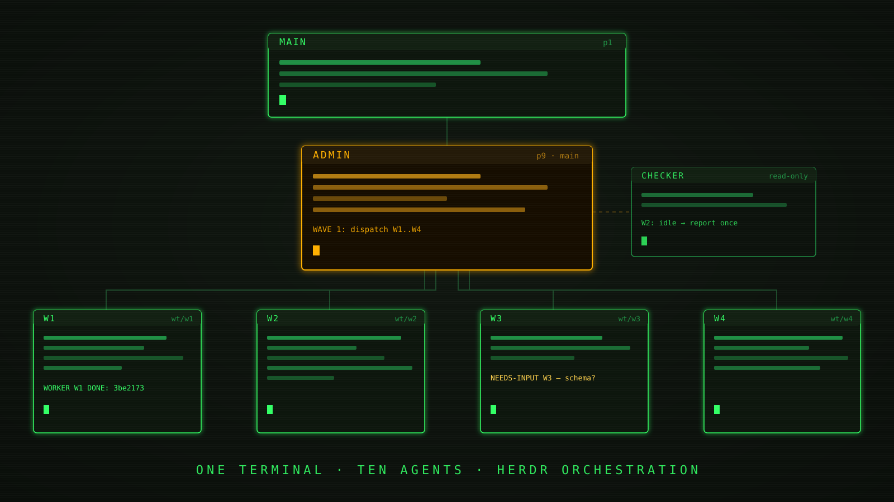

# One Terminal, Ten Agents: Herdr Orchestration



One coding agent is powerful. Ten coding agents stepping on each other is a
disaster you get to watch in real time: two of them edit the same file, a
third force-pushes over the second, and a fourth cheerfully reports "all tests
passing" on a branch that no longer exists.

Herdr orchestration is the discipline layer that makes the ten-agent version
work: one orchestrator, N workers, zero merge collisions. It's not a
framework. It's a small skill — a hierarchy, a handful of scripts, three
sentinel strings, and a list of hard rules — that turns a tmux-style pane grid
into a fleet you can actually trust.

This article explains how it works, why every rule in it is a scar from a real
failure, and how the skill ended up publishing itself.

## The problem with one agent (and with ten naive ones)

A single agent has three ceilings you hit fast:

1. **Serial work.** One agent does one thing at a time. A five-slice refactor
   takes five slices' worth of wall clock, even when the slices don't touch.
2. **One context window.** Everything — your instructions, the code it read,
   the errors it hit — competes for the same finite attention. Big tasks
   degrade in quality precisely when they need it most.
3. **Self-review blindness.** An agent reviewing its own diff has the same
   blind spots that produced the diff. It wrote the bug because it believed
   the bug; it will approve the bug for the same reason.

The obvious fix — "just run more agents" — is worse than the disease if you do
it naively. Two agents in the same checkout will eventually write the same
file, and the last save wins silently. No conflict marker, no error. One
agent's work simply evaporates, and nobody notices until something downstream
breaks. Parallelism without isolation isn't speed; it's data loss with extra
steps.

So the real problem statement is: how do you get parallel throughput and
independent review *without* shared mutable state and *without* a human
babysitting every pane?

## The hierarchy

Herdr's answer is a strict chain of command. Four roles, no layer skipped:

```
        you (the human)
              │
            MAIN          user-facing; never writes code
              │
            ADMIN         orchestrates; never edits source
        ┌─────┼─────┐
       W1    W2    W3     one worktree, one branch, one pane each
        │     │     │
       C1    C2    C3     checkers: read-only observers, one per worker
```

- **Main** talks to the human and to nobody else below Admin. It routes
  instructions down and reports outcomes up. It never touches code, and — this
  matters — it never blocks waiting on the fleet. Main dispatches and returns
  to idle; Admin wakes it when there's something worth waking for. Only the
  human blocks Main.
- **Admin** is the orchestrator. It lives on the main branch with no worktree
  of its own, dispatches workers, watches their state, and integrates results.
  It never edits a source file. Ever.
- **Workers** each get one git worktree, one branch, one pane. They report to
  Admin only — never to Main, never to each other.
- **Checkers** are the trick most setups miss: one read-only observer per
  active worker, owned by Admin. A checker watches a worker's pane, classifies
  what it sees — still working, idle, stuck, waiting on a question — and
  reports the classification to Admin exactly once. Observation is a job, so
  the orchestrator's attention doesn't have to be.

Information flows Main → Admin → Workers and back up the same path. When a
worker has a question, it asks Admin. When Admin needs a human decision, it
surfaces through Main. Nobody shouts across the room.

## Five mechanisms that make it work

**1. Worktree topology.** Every implementation worker gets its own git
worktree on its own branch. This is physical isolation, not politeness: two
workers *cannot* race on a file because they don't share a filesystem view of
it. The failure mode "last save wins" is structurally impossible. Merge
conflicts still exist — but they surface loudly at integration time, as
conflicts, instead of silently at write time, as vanished work.

**2. Waves.** Work is dispatched in dependency-ordered batches. Everything
that's independent goes out in one wave, in parallel; anything that needs a
prior result waits for the next wave. The discipline is in the ordering, not
the tooling — Admin decides what's truly independent *before* launching, which
is exactly the analysis a hurried human skips.

**3. Sentinels.** Workers signal state with one of three exact strings:

```
WORKER <ID> DONE: <sha>
NEEDS-INPUT <ID> — <question>
BLOCKER <ID> — <what>
```

That's the whole protocol. Admin and checkers classify on these literal
strings — no parsing prose, no inferring mood from a wall of agent output. An
agent saying "I think I'm mostly finished" is noise; `WORKER W2 DONE: 3be2173`
is a checkable claim with a commit hash attached. If the sentinel isn't there,
the work isn't done, whatever the transcript says.

**4. The checker pattern.** Admin never polls blind. Instead of the
orchestrator burning its context re-reading worker panes every thirty seconds,
each worker gets a dedicated read-only checker that watches until the pane
settles, classifies the outcome, and reports once. Admin gets a stream of
classifications, not a stream of terminal scrollback. This is the difference
between an orchestrator that scales to ten workers and one that drowns at
three.

**5. The delivery gate.** Nothing merges to main without explicit human
approval. Not "the tests passed," not "the reviewer agent approved it" —
a human said the word, or it doesn't land. Every autonomous layer below this
gate can be wrong at machine speed; the gate ensures wrongness accumulates on
branches, where it's cheap, instead of on main, where it isn't.

## Hard rules, and the scar behind each one

The skill ships with a list of hard rules. None of them are theoretical — each
one is the fossil of a specific failure.

- **Admin never edits source.** The moment the orchestrator starts "just
  quickly fixing" things, you have an unreviewed writer with god-view and no
  isolation — the exact thing the worktree topology exists to prevent. Scar:
  an orchestrator's five-line hotfix conflicting with the worker branch it was
  supervising.
- **Never merge without explicit approval.** Autonomy is for producing work,
  not for deciding it ships. Scar: every story you've ever heard that contains
  the phrase "and then the agent pushed to main."
- **Never treat a worker's `completed` status as verification.** A pane going
  idle means the agent stopped, not that it succeeded. The rule demands the
  sentinel, push evidence, integration, and passing tests — four independent
  signals, because any one of them alone has lied before.
- **Fails loud beats fails silent.** Every wrapper script in the skill exits
  nonzero with a clear message rather than returning empty output. A loud
  failure costs you a retry; a silent one costs you the twenty minutes of
  fleet work built on top of it before anyone noticed.
- **Never reuse a delivered integration branch.** Delivered means done. New
  work gets a new branch, or you're quietly mutating something a human already
  approved.

The pattern across all of them: **predictability over cleverness.** Same
process every time — not the same output, the same *process*. The value of an
orchestration layer is that you stop being surprised by *how* things went
wrong, so you can spend your attention on the work itself.

## The skill shipped itself

Here's the part I enjoy most. This skill — the one described above — was
migrated into its public repository *by a herdr fleet running the skill*.

Main took the order. Admin dispatched a worker in an isolated worktree to port
the skill into the repo's format. A checker watched the worker. The worker
signalled `DONE` with a commit hash, opened a PR, CI went green, a human said
"merge," and Admin merged it. The publication of the orchestration skill was
itself an exercise of the orchestration skill, gate and all.

Before publishing, we also ran a staged dry-run: a scratch fleet (cheap
models, disposable workspace) executed the skill end-to-end while the session
log recorded everything. Seven checks passed, one wasn't exercised — and the
run surfaced two real gaps in the skill text that no amount of re-reading had
caught:

1. **A script-path assumption.** The skill assumed its helper scripts lived at
   one fixed install path. Installed anywhere else — a repo checkout, a
   different skills directory — every script call would miss. The fix:
   resolve paths relative to wherever the `SKILL.md` actually lives, never a
   hardcoded location.
2. **An unproven "fails loud" claim.** The docs asserted the wrapper scripts
   fail loudly; nothing had ever demonstrated it. The claim was true, but
   untested truth in an orchestration contract is just a rumor with good
   posture.

Both fixes landed as their own PRs, through the same gate. Dogfooding is a
cliché; *being unable to ship yourself without passing your own delivery gate*
is a design property.

## Try it

The skill is open source and installs into any agent setup that speaks the
[Agent Skills](https://agentskills.io) format:

```bash
npx skills add askprateek/skills/herdr-orchestration
```

What's in the box:

- `SKILL.md` — the shared contract: hierarchy, sentinels, hard rules.
- `roles/` — one file per role (Main, Admin, Worker), so each agent loads
  only what its job needs.
- `scripts/` — fail-loud wrappers for launching workers in worktrees,
  messaging panes, awaiting idle states, and listing the fleet.

Repo, with a sibling skill for Orca users and more on the way:
**https://github.com/askprateek/skills**

Run a fleet. Keep the gate.
